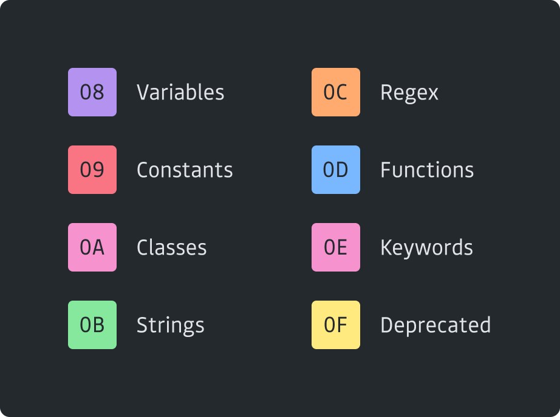

# Base16 Prime Dark Scheme

</img>

This is a very loose Base16 adaptation of the GitHub theme for Visual Studio
Code. [1] This theme uses colors from GitHub's Primer design system. [2]

- [1] https://marketplace.visualstudio.com/items?itemName=GitHub.github-vscode-theme
- [2] https://primer.style/css/support/color-system

